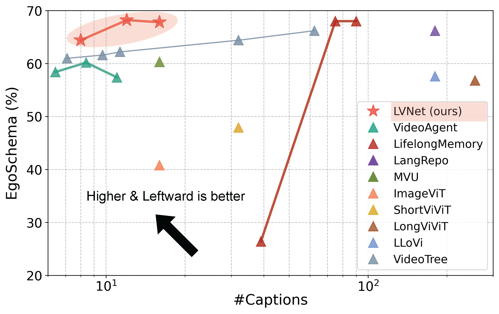

# LVNet
[](https://paperswithcode.com/sota/zero-shot-video-question-answer-on-egoschema-1?p=too-many-frames-not-all-useful-efficient)
[](https://paperswithcode.com/sota/zero-shot-video-question-answer-on-intentqa?p=too-many-frames-not-all-useful-efficient)
[](https://paperswithcode.com/sota/zero-shot-video-question-answer-on-next-qa?p=too-many-frames-not-all-useful-efficient)
[](https://paperswithcode.com/sota/zero-shot-video-question-answer-on-egoschema?p=too-many-frames-not-all-useful-efficient)

Official Code for **_Too Many Frames, Not All Useful_: Efficient Strategies for Long-Form Video QA**

It is accepted in the 9 pages workshop on Video-Language Models at **NeurIPS 2024**

[Paper Link](https://arxiv.org/abs/2406.09396) 

## Abstract
Long-form videos that span across wide temporal intervals are highly information-
redundant and contain multiple distinct events or entities that are often loosely-
related. Therefore, when performing long-form video question answering (LVQA),
all information necessary to generate a correct response can often be contained
within a small subset of frames. Recent literature explore the use of large language
models (LLMs) in LVQA benchmarks, achieving exceptional performance, while
relying on vision language models (VLMs) to convert all visual content within
videos into natural language. Such VLMs often independently caption a large
number of frames uniformly sampled from long videos, which is not efficient and
can mostly be redundant. Questioning these decision choices, we explore optimal
strategies for key-frame selection and sequence-aware captioning, that can signifi-
cantly reduce these redundancies. We propose two novel approaches that improve
each of aspects, namely Hierarchical Keyframe Selector and Sequential Visual
LLM. Our resulting framework termed LVNet achieves state-of-the-art performance
across three benchmark LVQA datasets

## Accuracy vs Captions on the EgoSchema Subset
- LVNet shows a SOTA 68.2% accuracy, merely at 12 captions.
- The result highlights the quality of keyframes from the hierarchical keyframe selector.


## Hierarchical Keyframe Selector: Structural Overview
- Overall strategy: Generate captions by hierarchical keyframe selector and feed them to the separate LLM to answer the question.
- Temporal Scene Clustering (TSC): Divides the long-video into scenes, enabling per-scene subsampling.
- Coarse Keyframe Detector (CKD): Selects frames best-aligned with keywords relevant to the query.
- Fine Keyframe detector (FKD): Selects frames by refining keyword alignements through a templated visual prompting.


## Hierarchical Keyframe Selector: Operational Visualization
- Temporal Scene Clustering (TSC): 900 frames get clustered into scenes and uniformly subsampled within each scene to output around 280 frames.
- Coarse Keyframe Detector (CKD): Coarse Keyframe Detector selects only 32 frames out of them, based on the alignment with keywords which are from options. 
- Visual Templating: Coarsely refined keyframes are then ordered according to confidence scores and temporal orders, and grouped them into 4 groups of 8 frames each. 
- Fine Keyframe Detector (FKD): Selects 12 frames by refining keyword alignments in  visual templates.


## Experiments: EgoSchema, NExT-QA, and IntentQA
- LVNet achieves state-of-the-art accuracies of 61.1%, 72.9%, and 71.7%  on the three datasets,
respectively, using just 12 frames compared to the models using the similar number of captions.
- Models with video-caption pretraining or utilizing significantly more captions than the 12 frames used
by LVNet are de-emphasized in grey or downplayed in light green to ensure fairness with image-level
pretraining or highlight caption efficiency.


## Comparison with Other Keyframe Selection Methods
This Figure compares LVNet and VideoAgent. **LVNet starts with uniformly sampled frames, then selects keyframes non-uniformly** through TSC, CKD, and FKD to highlight relevant content. This yields 12 frames, 8 of which show “phone usage,” the correct activity. In contrast, **VideoAgent continues uniform sampling** due to insufficient initial frames, yeilding 0 relevant frames out of 9 and ultimately choosing the wrong answer.<br><br>


## Evaluation
### Generate Answers Using LLM
You can easily run the LLM to generate answers for the questions using the pre-generated captions.

1. **Download the Captions for Dataset**

* EgoSchema: `bash scripts/get_ES_captions.sh `

2. **Run LLM** `bash scripts/eval_ES.sh`

### Generate captions using our provided modules
#### Hierarchical Keyframe Selector (HKS)
- Temporal Scene Clustering (TSC): temporalSceneClustering.py </br>
- Coarse Keyframe Detector (CKD): coarseKeyframeDetector.py </br>
- Fine Keyframe detector (FKD): fineKeyframeDetector.py </br>

1. **EgoSchema keyframe selection from images**: `bash config/run.sh `

2. **Generate captions based on the keyframes**: `bash scripts/create_caption.sh`

## Data
### Hierarchical Keyframe Selector hyper-parameters & paths
- [[LINK]](config/config.py)

### coarseKeyframeDetector.py CLIP model checkpoint
- ICCV 2023 [Perceptual Grouping in Contrastive Vision-Language Models](https://arxiv.org/abs/2210.09996)
- Checkpoint: [Download](https://github.com/kahnchana/clippy/releases/download/v1.0/clippy_5k.pt)


# Citation
```
@inproceedings{Park2024TooMF,
  title={Too Many Frames, not all Useful: Efficient Strategies for Long-Form Video QA},
  author={Jongwoo Park and Kanchana Ranasinghe and Kumara Kahatapitiya and Wonjeong Ryoo and Donghyun Kim and Michael S. Ryoo},
  year={2024}
}
```

