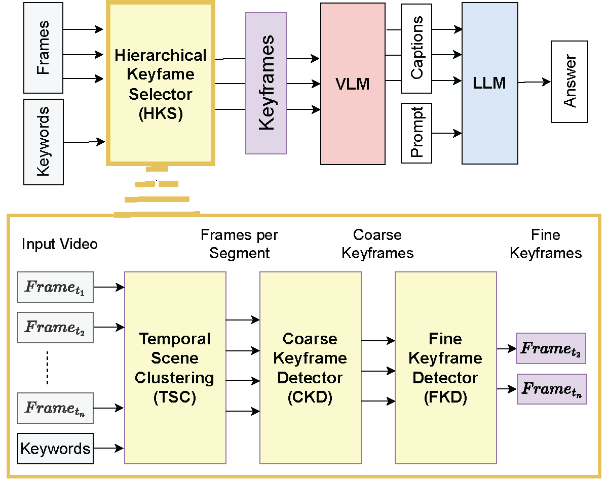
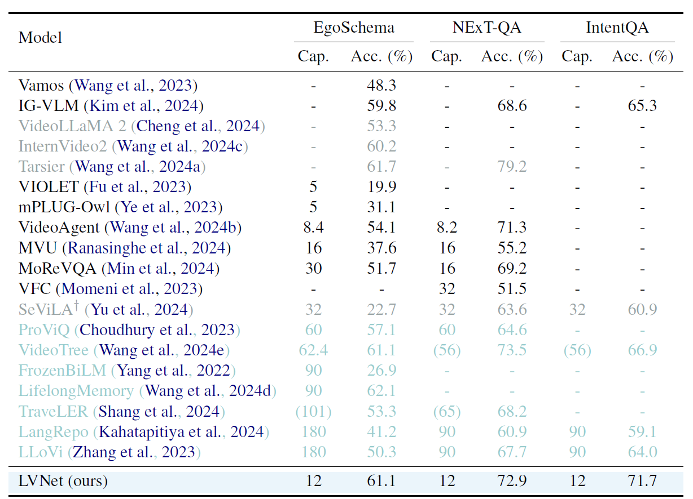

# 🎞️ LVNet: Hierarchical Keyframe Selector for Long Video
### [Main Conference @ EACL'26] [Workshop @ NeurIPS'24]

Official Code for **_Too Many Frames, Not All Useful_: Efficient Strategies for Long-Form Video QA**

We propose LVNet, a modular and training-free hierarchical keyframe selector for very long videos.

[Paper Link](https://arxiv.org/abs/2406.09396) | [Daily Papers in HF](https://huggingface.co/papers/2406.09396) | [Model Ckpt](https://huggingface.co/jongwoopark7978/LVNet)


## Comparison with Other Keyframe Selection Methods
- The videos below compare LVNet to two representative two-stage keyframe selection baselines, VideoAgent and VideoTree, on the same 3-minute EgoSchema example.  
- LVNet’s hierarchical keyframe selector (TSC → CKD → FKD) concentrates the caption budget on the most relevant moments, which leads to selecting the correct option **(e) Phones**.  
- In contrast, VideoAgent and VideoTree extract many less-informative frames for this query, and end up selecting incorrect options (c), (d).

### ⬇️ LVNet (Ours) selects (e) - Correct

<br>

### ⬇️ VideoAgent selects (d) - Wrong 

<br>

### ⬇️ VideoTree selects (c) - Wrong


This Figure compares keyframe selection stages of LVNet and VideoAgent shwon in the demo above. **LVNet starts with uniformly sampled frames, then selects keyframes non-uniformly** through TSC, CKD, and FKD to highlight relevant content. This yields 12 frames, 8 of which show “phone usage,” the correct activity. In contrast, **VideoAgent continues uniform sampling** due to insufficient initial frames, yeilding 0 relevant frames out of 9 and ultimately choosing the wrong answer.<br><br>


## Abstract
Long-form videos that span across wide temporal intervals are highly information redundant and contain multiple distinct events or entities that are often loosely related. Therefore, when performing long-form video question answering (LVQA), all information necessary to generate a correct response can often be contained within a small subset of frames. Recent literature leverage large language models (LLMs) in LVQA benchmarks, achieving exceptional performance, while relying on vision language models (VLMs) to convert all visual content within videos into natural language. Such VLMs often independently caption a large number of frames uniformly sampled from long videos, which is not efficient and can mostly be redundant. Motivated by this inefficiency, we propose LVNet, a modular and training-free framework featuring a novel Hierarchical Keyframe Selector (HKS) that efficiently selects a minimal set of informative frames tailored to each question. LVNet's modularity allows easy integration with existing approaches for more efficient LVQA. We achieve state-of-the-art performance among similarly configured models across four benchmark LVQA datasets: EgoSchema, NExT-QA, IntentQA, VideoMME.

## Accuracy vs Captions on the EgoSchema Subset
- LVNet shows a SOTA 68.2% accuracy, merely at 12 captions.
- The result highlights the quality of keyframes from the LVNet's hierarchical keyframe selector..


## Hierarchical Keyframe Selector: Structural Overview
- Overall strategy: Generate captions by hierarchical keyframe selector and feed them to the separate LLM to answer the question.
- Temporal Scene Clustering (TSC): Divides the long-video into scenes, enabling per-scene subsampling.
- Coarse Keyframe Detector (CKD): Selects frames best-aligned with keywords relevant to the query.
- Fine Keyframe detector (FKD): Selects frames by refining keyword alignements through a templated visual prompting.


## Hierarchical Keyframe Selector: Operational Visualization
- Temporal Scene Clustering (TSC): 900 frames get clustered into scenes and uniformly subsampled within each scene to output around 280 frames.
- Coarse Keyframe Detector (CKD): Coarse Keyframe Detector selects only 32 frames out of them, based on the alignment with keywords which are from options. 
- Visual Templating: Coarsely refined keyframes are then ordered according to confidence scores and temporal orders, and grouped them into 4 groups of 8 frames each. 
- Fine Keyframe Detector (FKD): Selects 12 frames by refining keyword alignments in  visual templates.


## Experiments: Comparison to Keyframe Selection Methods on VideoMME
Table shows LVNet’s performance on VideoMME’s long split, which features videos up to an hour long. In combination with an open-source LLM (DeepSeek-V3), LVNet outperforms the single-stage keyframe selection methods VideoChat-T and Frame-Voyager without any video-level training. Moreover, LVNet outperforms the two-stage keyframe selectors VideoAgent and VideoTree under the identical GPT-4o and 24-frame budget settings. 


## Efficiency
- On a single NVIDIA RTX A5000 GPU with a 180-frame input video, LVNet finishes in 25.6 s (7.0 FPS), achieving 3.4× and 2.5× speedups over VideoAgent (87.3 s, 2.1 FPS) and VideoTree (64.2 s, 2.8 FPS). The main gap comes from LVNet’s lightweight HKS (TSC+CKD+FKD) to select keyframes quickly and applies the expensive captioner+LLM only once on the final selected frames.

<br>

- LVNet processes 1,800 frames in 61.9 s (29.1 FPS) on a single GPU, while Qwen2.5-VL-72B encounters out of memory (OOM) at 24 frames. Despite architectural and hardware differences, it shows that LVNet’s keyframe selector is scalable to process large number of frames in long-form video as it is lightweight, single-GPU-friendly, and provides high FPS.

<br>

- Table shows the inference cost and performance against purely GPT-4o prompting. LVNet delivers competitive accuracy with over 10× lower per-video LLM cost, thanks to efficient keyframe selection.


<!-- ## Experiments: EgoSchema, NExT-QA, and IntentQA
- LVNet achieves state-of-the-art accuracies of 61.1%, 72.9%, and 71.7%  on the three datasets,
respectively, using just 12 frames compared to the models using the similar number of captions.
- Models with video-caption pretraining or utilizing significantly more captions than the 12 frames used
by LVNet are de-emphasized in grey or downplayed in light green to ensure fairness with image-level
pretraining or highlight caption efficiency.

 -->

## Evaluation
### Generate Answers Using LLM
You can easily run the LLM to generate answers for the questions using the pre-generated captions.

1. **Download the Captions for Dataset**

* EgoSchema: `bash scripts/get_ES_captions.sh `

2. **Run LLM** `bash scripts/eval_ES.sh`

### Generate captions using our provided modules
#### Hierarchical Keyframe Selector (HKS)
- Temporal Scene Clustering (TSC): temporalSceneClustering.py </br>
- Coarse Keyframe Detector (CKD): coarseKeyframeDetector.py </br>
- Fine Keyframe detector (FKD): fineKeyframeDetector.py </br>

1. **EgoSchema keyframe selection from images**: `bash config/run.sh `

2. **Generate captions based on the keyframes**: `bash scripts/create_caption.sh`

## Data
### Hierarchical Keyframe Selector hyper-parameters & paths
- [[LINK]](config/config.py)

### coarseKeyframeDetector.py CLIP model checkpoint
- ICCV 2023 [Perceptual Grouping in Contrastive Vision-Language Models](https://arxiv.org/abs/2210.09996)
- Checkpoint: [Download](https://github.com/kahnchana/clippy/releases/download/v1.0/clippy_5k.pt)


# Citation
```
@inproceedings{Park2024TooMF,
  title={Too Many Frames, not all Useful: Efficient Strategies for Long-Form Video QA},
  author={Jongwoo Park and Kanchana Ranasinghe and Kumara Kahatapitiya and Wonjeong Ryoo and Donghyun Kim and Michael S. Ryoo},
  year={2024}
}
```
